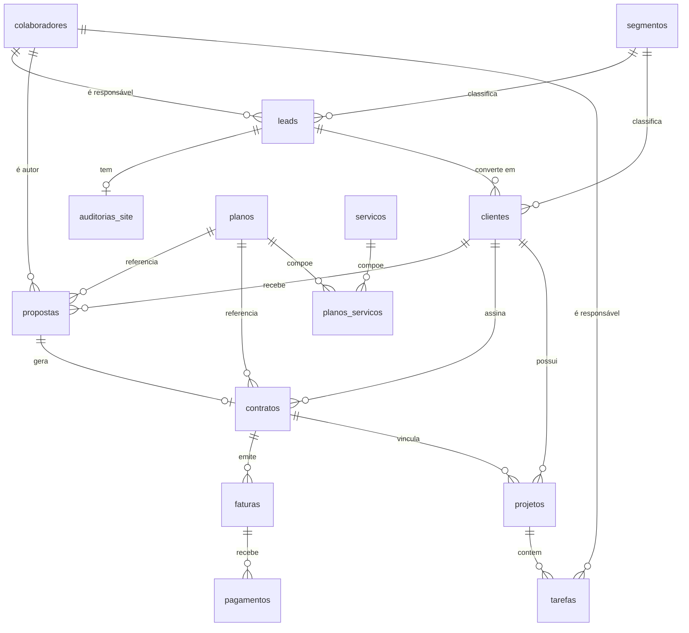
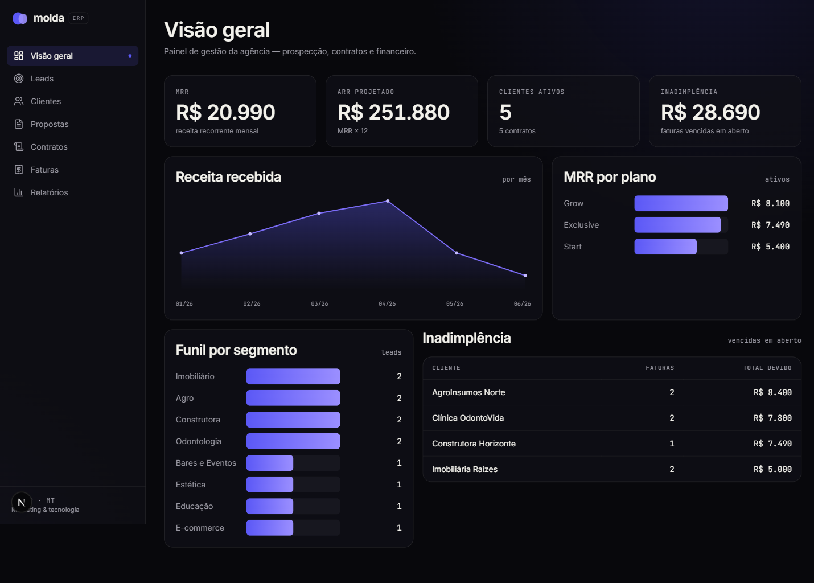
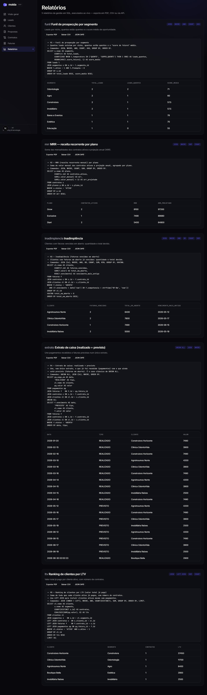
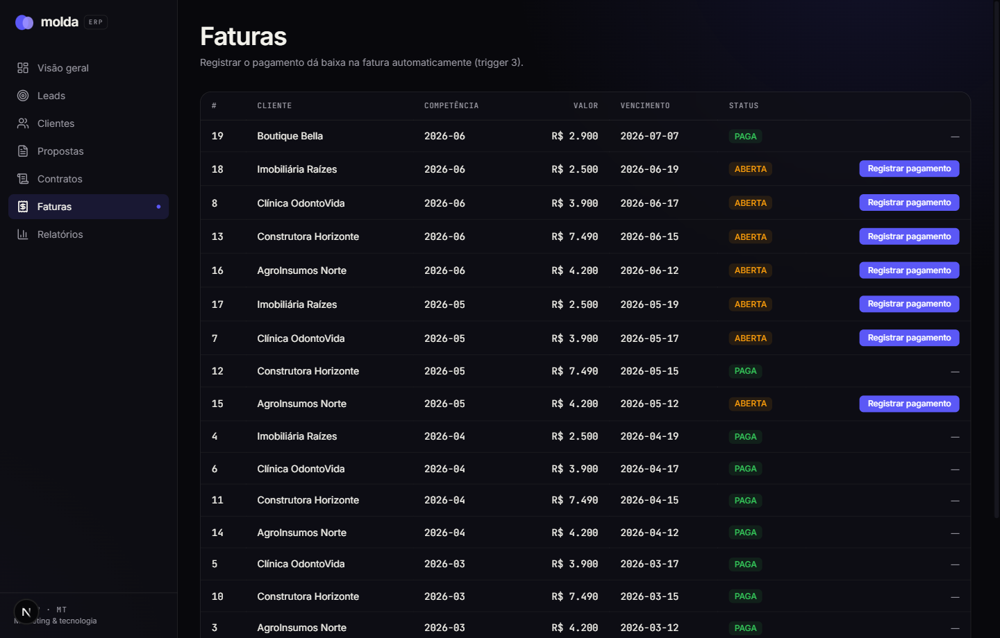

# ERP Molda — Documentação do Banco de Dados

**Centro Universitário UNIFASIPE — Análise e Desenvolvimento de Sistemas (3º semestre)**
**Disciplina:** Banco de Dados — Atividade Avaliativa N3
**Aluno:** Walisson Vinicius
**Professor(a):** _______________
**Sinop/MT — 2026**

---

## Sumário

1. Apresentação do ERP
2. Objetivo e temática
3. Arquitetura e tecnologias
4. Padrões de nomenclatura
5. Modelo de dados (diagrama de entidade-relacionamento)
6. Dicionário de dados (explicação de cada tabela)
7. Tratamentos de campos
8. Triggers (automação das regras de negócio)
9. Relatórios SQL de gerenciamento
10. Como reproduzir o banco
11. Telas do sistema
12. Entrega

---

## 1. Apresentação do ERP

A **Molda** é uma agência digital de Sinop/MT que une marketing e tecnologia: cria sites, aplicativos, sistemas e automações sob medida, e opera com **planos mensais recorrentes** (Start, Grow, Exclusive e Enterprise).

Este ERP foi projetado para controlar a operação real da agência, do primeiro contato com um possível cliente até o recebimento das mensalidades. Ele cobre quatro frentes:

- **Prospecção (CRM):** captação e qualificação de leads, com auditoria do site de cada lead.
- **Comercial:** propostas e contratos de assinatura.
- **Financeiro recorrente:** faturas mensais, pagamentos e inadimplência.
- **Operação:** projetos entregues e suas tarefas.

## 2. Objetivo e temática

O objetivo do banco é ser a **fonte única de verdade** da gestão da agência, respondendo perguntas como: *Qual a receita recorrente mensal (MRR)? Quais clientes estão inadimplentes? De onde vêm os melhores leads? Quais clientes geram mais valor (LTV)?*

A temática — **agência digital com receita recorrente** — foi escolhida por ser um cenário rico em relacionamentos (um cliente tem várias propostas; uma proposta vira um contrato; um contrato gera várias faturas; cada fatura recebe pagamentos), o que permite explorar a fundo relacionamentos, tratamentos de campos, triggers e relatórios.

## 3. Arquitetura e tecnologias

| Camada | Tecnologia |
|---|---|
| Banco de dados | **SQLite** (via libSQL/Turso em produção) |
| Aplicação | Next.js 16 (App Router) + TypeScript |
| Acesso a dados | `@libsql/client` executando **SQL puro** |
| Interface | Tailwind CSS v4, identidade visual da Molda |
| Hospedagem | Vercel (aplicação) + Turso (banco) |

O banco é definido em SQL puro no arquivo `db/schema.sql`, com dados de exemplo em `db/seed.sql`. Os cinco relatórios ficam em `db/reports/` como arquivos `.sql` independentes, executados pela aplicação e exibidos ao usuário final.

## 4. Padrões de nomenclatura

Para manter o banco organizado e legível, foram adotados os seguintes padrões:

- **Tabelas:** nome no plural, em `snake_case` e em português (ex.: `clientes`, `planos_servicos`).
- **Chave primária:** sempre a coluna `id` (`INTEGER PRIMARY KEY AUTOINCREMENT`).
- **Chave estrangeira:** `<entidade no singular>_id` (ex.: `cliente_id`, `plano_id`).
- **Datas de controle:** `criado_em` e, quando aplicável, `atualizado_em`.
- **Situações/estados:** coluna `status` com valores em maiúsculas, restritos por `CHECK`.
- **Valores monetários:** tipo `REAL`, em reais.

## 5. Modelo de dados (DER)

O banco possui **14 tabelas** organizadas em quatro módulos. O diagrama abaixo mostra as entidades e seus relacionamentos.

**Cardinalidades principais:**

- Um **segmento** classifica vários **leads** e vários **clientes**.
- Um **lead** tem no máximo uma **auditoria de site** (1:1) e pode se converter em um **cliente**.
- Um **cliente** tem várias **propostas**, vários **contratos** e vários **projetos**.
- Um **plano** participa de várias **propostas/contratos** e agrega vários **serviços** (N:N via `planos_servicos`).
- Uma **proposta** gera no máximo um **contrato** (1:1 opcional).
- Um **contrato** emite várias **faturas**; cada **fatura** recebe vários **pagamentos**.
- Um **projeto** contém várias **tarefas**.

## 6. Dicionário de dados

### Módulo CRM / Prospecção

**`segmentos`** — nichos de mercado atendidos (Odontologia, Construtora, Agro, etc.).

| Coluna | Tipo | Restrições |
|---|---|---|
| id | INTEGER | PK, AUTOINCREMENT |
| nome | TEXT | NOT NULL, UNIQUE |
| descricao | TEXT | — |
| ativo | INTEGER | NOT NULL, DEFAULT 1, CHECK (0 ou 1) |
| criado_em | TEXT | NOT NULL, DEFAULT data/hora atual |

**`colaboradores`** — equipe da agência (sócios e vendedores) que cuida de leads e propostas.

| Coluna | Tipo | Restrições |
|---|---|---|
| id | INTEGER | PK |
| nome | TEXT | NOT NULL |
| email | TEXT | UNIQUE |
| papel | TEXT | CHECK (SOCIO, DEV, MARKETING, COMERCIAL) |
| ativo | INTEGER | DEFAULT 1, CHECK (0 ou 1) |

**`leads`** — empresas prospectadas, com pontuação de oportunidade (`score_feiura`: quanto pior o site atual, mais quente o lead).

| Coluna | Tipo | Restrições |
|---|---|---|
| id | INTEGER | PK |
| nome | TEXT | NOT NULL |
| segmento_id | INTEGER | FK → segmentos, NOT NULL |
| responsavel_id | INTEGER | FK → colaboradores (ON DELETE SET NULL) |
| score_feiura | INTEGER | CHECK (0 a 100) |
| temperatura | TEXT | CHECK (FRIO, MORNO, QUENTE, SUPER_QUENTE) |
| tier | INTEGER | CHECK (1 a 3) |
| franquia | INTEGER | CHECK (0 ou 1) |
| status | TEXT | CHECK (NOVO, EM_CONTATO, CONVERTIDO, PERDIDO) |
| convertido_em | TEXT | preenchido por trigger na conversão |

**`auditorias_site`** — diagnóstico técnico do site do lead. Relação **1:1** com `leads` (coluna `lead_id` é `UNIQUE`).

| Coluna | Tipo | Restrições |
|---|---|---|
| id | INTEGER | PK |
| lead_id | INTEGER | FK → leads, NOT NULL, UNIQUE |
| https / mobile_ok / tem_whatsapp | INTEGER | CHECK (0 ou 1) |
| tempo_carga_ms | INTEGER | CHECK (≥ 0) |

**`clientes`** — leads convertidos (ou entradas diretas) que passam a ser atendidos.

| Coluna | Tipo | Restrições |
|---|---|---|
| id | INTEGER | PK |
| nome | TEXT | NOT NULL |
| segmento_id | INTEGER | FK → segmentos, NOT NULL |
| lead_origem_id | INTEGER | FK → leads (ON DELETE SET NULL) |
| cnpj / email | TEXT | UNIQUE |
| uf | TEXT | CHECK (2 caracteres) |
| status | TEXT | CHECK (PROSPECCAO, ATIVO, INATIVO) |

### Módulo Catálogo

**`planos`** — planos mensais recorrentes (Start, Grow, Exclusive, Enterprise).

| Coluna | Tipo | Restrições |
|---|---|---|
| id | INTEGER | PK |
| nome | TEXT | NOT NULL, UNIQUE |
| preco_mensal | REAL | NOT NULL, CHECK (≥ 0) |
| verba_minima_midia | REAL | DEFAULT 0, CHECK (≥ 0) |

**`servicos`** — itens que compõem os planos (site, artes, vídeos, tráfego, IA, etc.).

**`planos_servicos`** — tabela associativa **N:N** entre planos e serviços, com a `quantidade` incluída em cada plano. A chave primária é composta por (`plano_id`, `servico_id`).

### Módulo Comercial / Financeiro

**`propostas`** — propostas comerciais enviadas aos clientes.

| Coluna | Tipo | Restrições |
|---|---|---|
| id | INTEGER | PK |
| cliente_id | INTEGER | FK → clientes, NOT NULL |
| plano_id | INTEGER | FK → planos, NOT NULL |
| autor_id | INTEGER | FK → colaboradores |
| valor | REAL | NOT NULL, CHECK (≥ 0) |
| status | TEXT | CHECK (RASCUNHO, ENVIADA, ACEITA, RECUSADA) |

**`contratos`** — assinaturas recorrentes. A coluna `valor_anual` é **gerada** automaticamente.

| Coluna | Tipo | Restrições |
|---|---|---|
| id | INTEGER | PK |
| proposta_id | INTEGER | FK → propostas, UNIQUE |
| cliente_id | INTEGER | FK → clientes, NOT NULL |
| plano_id | INTEGER | FK → planos, NOT NULL |
| valor_mensal | REAL | NOT NULL, CHECK (≥ 0) |
| valor_anual | REAL | **GERADA**: valor_mensal × 12 (STORED) |
| data_assinatura | TEXT | DEFAULT data atual |
| status | TEXT | CHECK (ATIVO, PAUSADO, CANCELADO) |

**`faturas`** — mensalidades emitidas por contrato. Há uma fatura por competência (`UNIQUE` em contrato + competência).

| Coluna | Tipo | Restrições |
|---|---|---|
| id | INTEGER | PK |
| contrato_id | INTEGER | FK → contratos, NOT NULL |
| competencia | TEXT | NOT NULL (formato AAAA-MM) |
| valor | REAL | NOT NULL, CHECK (≥ 0) |
| vencimento | TEXT | NOT NULL |
| status | TEXT | CHECK (ABERTA, PAGA, ATRASADA, CANCELADA) |

**`pagamentos`** — pagamentos recebidos por fatura (admite pagamento parcial).

| Coluna | Tipo | Restrições |
|---|---|---|
| id | INTEGER | PK |
| fatura_id | INTEGER | FK → faturas, NOT NULL |
| valor | REAL | NOT NULL, CHECK (> 0) |
| metodo | TEXT | CHECK (PIX, CARTAO, BOLETO, DINHEIRO) |

### Módulo Operação

**`projetos`** — entregas executadas para o cliente (site, landing, app, sistema, automação, marketing).

**`tarefas`** — tarefas que compõem cada projeto, com responsável e horas trabalhadas.

## 7. Tratamentos de campos

O banco aplica diversos tratamentos para garantir integridade e qualidade dos dados:

- **Integridade referencial:** `PRAGMA foreign_keys = ON` e chaves estrangeiras com a ação adequada — `RESTRICT` no catálogo (não deixa apagar um plano em uso), `CASCADE` em dependentes (apagar um projeto apaga suas tarefas) e `SET NULL` em vínculos opcionais (a origem de um cliente).
- **Obrigatoriedade e unicidade:** `NOT NULL` nos campos essenciais e `UNIQUE` em e-mails, CNPJ, nome de plano/segmento e na relação 1:1 de auditoria.
- **Domínios controlados (`CHECK`):** todos os campos de `status` aceitam apenas valores válidos; faixas numéricas são validadas (`score_feiura` entre 0 e 100, `tier` entre 1 e 3, valores monetários ≥ 0; `uf` com 2 caracteres).
- **Valores padrão (`DEFAULT`):** `criado_em` recebe a data/hora atual; campos booleanos assumem 0/1; `status` recebe o estado inicial.
- **Coluna gerada:** `contratos.valor_anual` é calculada pelo próprio banco como `valor_mensal * 12` (`GENERATED ALWAYS AS ... STORED`), evitando redundância e inconsistência.
- **Índices:** criados nas chaves estrangeiras e nas colunas mais filtradas pelos relatórios (`faturas.status`, `faturas.competencia`, `leads.temperatura`), melhorando o desempenho das consultas.

## 8. Triggers

Sete triggers automatizam as regras de negócio:

1. **`trg_proposta_aceita_gera_contrato`** — quando uma proposta muda para `ACEITA`, cria automaticamente o contrato correspondente.
2. **`trg_contrato_novo_gera_fatura`** — ao inserir um contrato ativo, gera a primeira fatura (na competência da assinatura, com vencimento em 7 dias).
3. **`trg_pagamento_quita_fatura`** — ao registrar um pagamento, **soma** (`SUM`) todos os pagamentos da fatura e, se atingirem o valor, marca a fatura como `PAGA`.
4. **`trg_contrato_cancelado_cancela_faturas`** — ao cancelar um contrato, cancela as faturas que ainda estavam em aberto.
5. **`trg_lead_convertido`** — quando um lead muda para `CONVERTIDO`, carimba a data/hora da conversão.
6. **`trg_proposta_valida_piso`** — impede (`RAISE(ABORT)`) o cadastro de uma proposta com valor abaixo do preço mínimo do plano.
7. **`trg_contratos_touch`** — mantém o campo `atualizado_em` do contrato sempre que ele é alterado.

> Os triggers 1 e 2 formam uma **cadeia**: aceitar uma proposta cria o contrato, que por sua vez gera a primeira fatura — tudo em uma única ação do usuário.

## 9. Relatórios SQL de gerenciamento

São cinco relatórios, cada um voltado a uma decisão de gestão. Juntos, eles aplicam todos os comandos exigidos: `WHERE`, `AND`, `OR`, `JOIN`, `UNION ALL`, `COUNT`, `SUM` (além dos `TRIGGERS` acima).

### Relatório 1 — Funil de prospecção por segmento
*Comandos: JOIN, WHERE, AND, COUNT.* Mostra, por nicho, quantos leads existem, quantos estão quentes e o score médio de oportunidade. Ajuda a decidir onde concentrar a prospecção. (`db/reports/01_funil_prospeccao.sql`)

### Relatório 2 — MRR (receita recorrente mensal) por plano
*Comandos: JOIN, WHERE, SUM, COUNT.* Soma o valor mensal dos contratos ativos por plano e projeta a receita anual (ARR). É o principal indicador de saúde do negócio. (`db/reports/02_mrr_por_plano.sql`)

### Relatório 3 — Inadimplência
*Comandos: JOIN, WHERE, AND, OR, COUNT, SUM.* Lista os clientes com faturas vencidas em aberto, com a quantidade e o total devido. Aciona a régua de cobrança. (`db/reports/03_inadimplencia.sql`)

### Relatório 4 — Extrato de caixa (realizado + previsto)
*Comandos: UNION ALL, JOIN, WHERE.* Une, em um único extrato ordenado por data, o que já foi recebido (pagamentos) com o que ainda está previsto (faturas em aberto). É o caso clássico de `UNION ALL`, pois combina duas origens com a mesma estrutura. (`db/reports/04_extrato_caixa.sql`)

### Relatório 5 — Ranking de clientes por LTV
*Comandos: JOIN (INNER + LEFT), WHERE, AND, COUNT, SUM.* Soma tudo o que cada cliente ativo já pagou (seu *lifetime value*) e mostra o número de contratos. O `LEFT JOIN` garante que clientes ainda sem pagamento também apareçam. (`db/reports/05_ltv_clientes.sql`)

> O código SQL completo de cada relatório está nos arquivos indicados e também é exibido na tela **Relatórios** do sistema, junto do resultado executado ao vivo.

## 10. Como reproduzir o banco

1. Criar o banco a partir do esquema: executar `db/schema.sql` em um banco SQLite (cria tabelas, índices e triggers).
2. Popular com dados de exemplo: executar `db/seed.sql`.
3. Rodar qualquer um dos relatórios em `db/reports/`.

No projeto, o comando `npm run db:build` automatiza os passos 1 e 2, gerando o arquivo `db/molda.db`.

## 11. Telas do sistema

**Figura 1 — Visão geral (dashboard):** KPIs de MRR, ARR, clientes ativos e inadimplência, com gráficos de receita por mês, MRR por plano e funil por segmento.

**Figura 2 — Relatórios:** os cinco relatórios com o SQL e o resultado executado ao vivo no banco.

**Figura 3 — Faturas:** ao registrar o pagamento, a fatura é quitada automaticamente pela trigger.

## 12. Entrega

- **Repositório (GitHub):** _______________
- **Aplicação (Vercel):** _______________
- **Composição da nota:** Banco de Dados (6,0) + Documentação (4,0).
